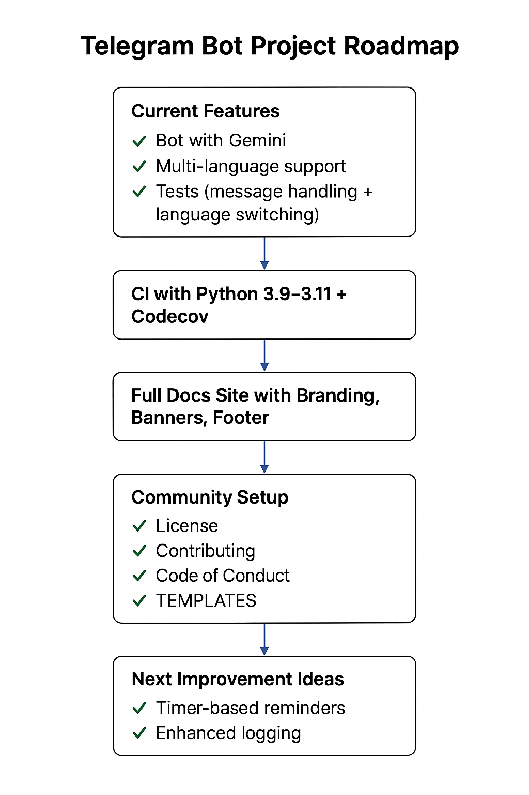

# 🛣️ Project Roadmap - Telegram Gemini Bot

This roadmap outlines upcoming features, improvements, and long-term goals for the project.

---

## ✅ Completed
- Gemini-powered Telegram bot
- Docker + Docker Compose support
- Kubernetes manifests + Helm chart
- GitHub Actions (CI/CD, Security, Docs)
- Pre-commit hooks (lint + security)
- GitHub Codespaces + Dev Containers
- MkDocs site with GitHub Pages
- Contributing + Code of Conduct + Templates

---

## 🚀 Short-Term Goals (Next 1-2 Months)
- [ ] Add more test coverage with advanced mocks
- [ ] Improve error handling & logging
- [ ] Multi-language support (via Gemini translation)
- [ ] Add rate limiting to prevent abuse
- [ ] Slash command support in Telegram (/help, /about)

---

## 🌍 Medium-Term Goals (3-6 Months)
- [ ] Persistent database support (Postgres/SQLite) for chat history
- [ ] Admin dashboard for monitoring conversations
- [ ] Prometheus/Grafana monitoring integration
- [ ] Deploy Helm chart to ArtifactHub for public use

---

## 🧠 Long-Term Vision (6-12 Months)
- [ ] Support for multiple LLMs (Gemini, OpenAI, Anthropic)
- [ ] Voice synthesis (TTS) for bot replies
- [ ] Plug-in system for custom extensions
- [ ] Scale to enterprise-grade deployment (K8s + autoscaling)

---

💡 Suggestions or ideas? Open an [issue](.github/ISSUE_TEMPLATE.md) or submit a PR!

## 📊 Visual Roadmap

This diagram shows completed features and planned improvements in a visual format.
