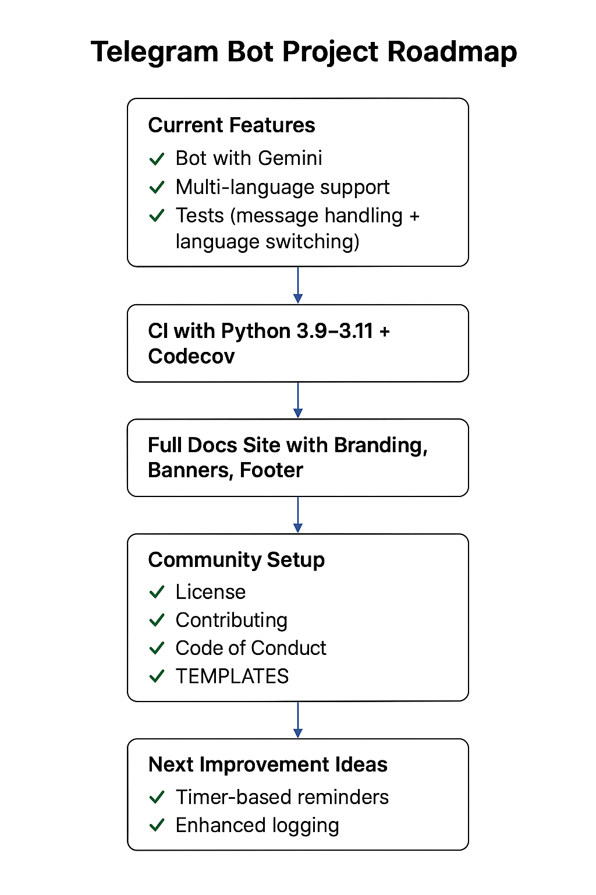

# 📊 Project Roadmap

This page shows both the **visual roadmap** and the detailed milestones.

---

## ✅ Completed
- Gemini-powered Telegram bot
- Docker & Docker Compose support
- Kubernetes manifests & Helm chart
- GitHub Actions (CI/CD, Security, Docs)
- MkDocs site with branding & themes
- Multi-language support with `/language`

---

## 🚀 Short-Term Goals (Next 1-2 Months)
- More test coverage with advanced mocks
- Better error handling & logging
- Rate limiting to prevent abuse
- Slash command support (/help, /about)

---

## 🌍 Medium-Term Goals (3-6 Months)
- Database persistence (Postgres/SQLite)
- Admin dashboard for monitoring conversations
- Prometheus/Grafana monitoring integration
- Publish Helm chart to ArtifactHub

---

## 🧠 Long-Term Vision (6-12 Months)
- Support multiple LLMs (Gemini, OpenAI, Anthropic)
- Voice synthesis (TTS) for bot replies
- Plugin system for custom extensions
- Enterprise-grade deployment (autoscaling on K8s)

---

## 📈 Visual Roadmap

  

[🔝 Back to top](#)
